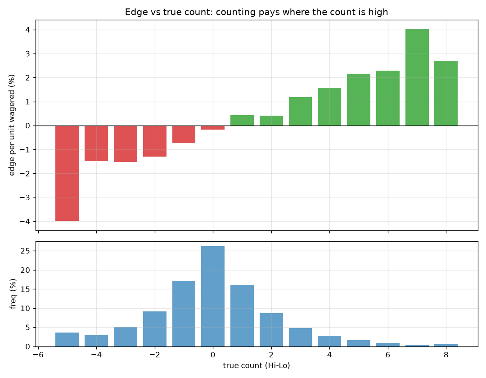
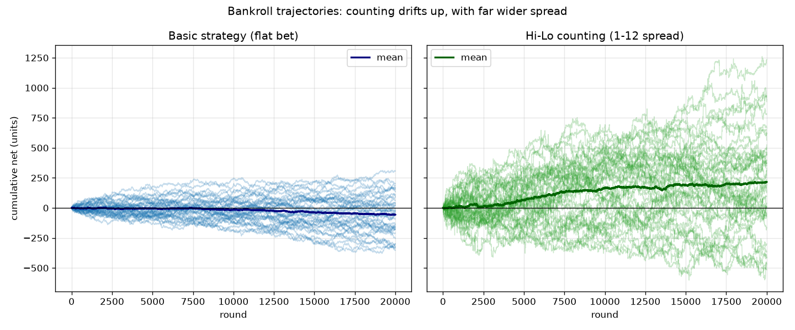
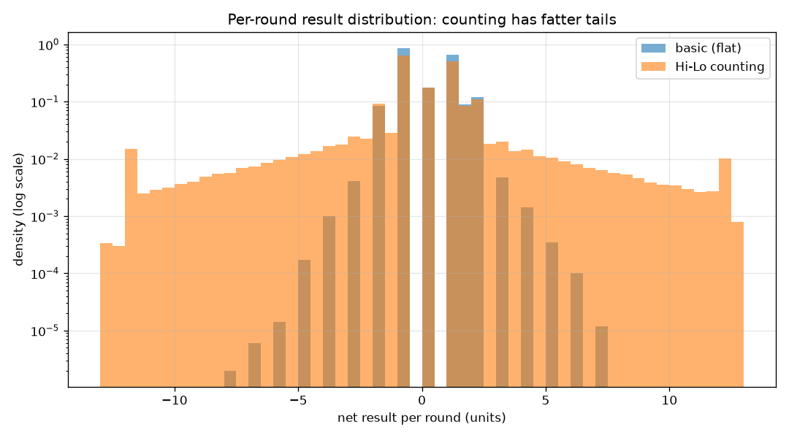

# blackjack-sim

A Monte Carlo blackjack simulator that quantifies the **expected value and
variance** of play under (1) flat-bet basic strategy and (2) Hi-Lo card
counting with a true-count bet ramp. The question it answers: *how much, and at
what variance cost, does card counting actually beat the house?*

This is a quant-research portfolio project — the interesting result is not the
blackjack engine but the **EV-vs-variance / bankroll trade-off**, the same logic
that governs position sizing in trading.

## Headline result

1,000,000 rounds, 6-deck shoe, dealer stands on soft 17, 75% penetration,
Hi-Lo with a 1-12 bet spread (reaching the max at true count +6):

| strategy                | avg bet | EV / unit wagered | std / round |
|-------------------------|--------:|------------------:|------------:|
| Basic strategy (flat)   |   1.00  |        **−0.27%** |        1.16 |
| Hi-Lo counting (1-12)   |   1.95  |        **+0.64%** |        3.38 |

Counting flips the edge from negative to positive — at roughly **8.6× the
per-round variance**. Over 20,000-round sessions, flat betting finished in
profit 38% of the time (mean −57 units); counting finished in profit 70% of the
time (mean +215 units), but with a much wider spread of outcomes.

## Why it works: edge vs true count

Playing decisions are *always* basic strategy. Counting changes only the **bet
size**. The realized edge rises monotonically with the Hi-Lo true count and
crosses zero near TC +1 — and the bet ramp deliberately puts more money on the
table exactly where the edge is positive. Most rounds occur at low counts (bet
the minimum, lose a little); the profit lives in the infrequent high-count right
tail.



## The cost: variance

EV is only half the story. Independent bankroll trajectories show counting
drifting upward on average while swinging far more widely than flat betting —
the advantage only materialises over many rounds and an adequately capitalised
bankroll.





## How it works

| Module | Responsibility |
|--------|----------------|
| `cards.py`   | `Shoe`: multi-deck build/shuffle/deal, penetration, decks remaining. Cards encoded by blackjack base value (2-9, 10 for tens, 11 for aces). |
| `rules.py`   | `Rules` dataclass: decks, S17/H17, DAS, blackjack payout, splits, penetration. |
| `hand.py`    | Hand totals with ace demotion, soft/hard, bust, natural detection. |
| `strategy.py`| Canonical 4-8 deck basic strategy (hard/soft/pairs) with H17 and no-DAS deviations. |
| `engine.py`  | `play_round`: deals, plays hit/stand/double/split/surrender, dealer S17/H17 logic, dealer peek, payout settlement. |
| `counting.py`| Hi-Lo running/true count (`HiLoCounter`) and the `BetRamp`. |
| `simulator.py`| `simulate`: the Monte Carlo loop, recording per-round net, bet, and true count. |
| `stats.py`   | EV/round, std, 95% CI, EV per unit wagered, EV-by-true-count, bankroll curve. |
| `cli.py`     | Command-line front end. |

The counter reads the dealt portion of the shoe between rounds (when every card,
including the dealer hole card, is exposed), so the engine needs no
instrumentation.

### Modelling notes / scope

- Counting affects **betting only**, not playing. Playing deviations (the
  "Illustrious 18") are intentionally out of scope so the betting effect is
  isolated.
- US-style peek (dealer checks for blackjack on a ten/ace upcard).
- Validation anchor: 6-deck S17 flat-bet basic strategy simulates to a small
  negative edge (~−0.3% to −0.5% per unit), matching the published house edge.

## Install

```bash
python -m venv .venv && source .venv/bin/activate
pip install -e .            # add ".[dev]" for pytest + jupyter
```

## Usage

```bash
# Compare flat-bet basic strategy vs Hi-Lo counting
python -m blackjack_sim.cli --rounds 1000000 --decks 6 --spread 1-12

# One strategy, H17 rules, write CSVs
python -m blackjack_sim.cli --strategy counting --h17 --out results/
```

Key flags: `--rounds`, `--decks`, `--penetration`, `--h17`, `--no-das`,
`--strategy {both,basic,counting}`, `--spread MIN-MAX`, `--top-tc`, `--seed`,
`--out`.

## Analysis notebook

[`notebooks/analysis.ipynb`](notebooks/analysis.ipynb) reproduces every figure
and table above, with the full narrative.

## Tests

```bash
pytest        # 45 tests: hand eval, shoe, strategy, engine payouts,
              # counting, and EV sanity bounds
```

## Reproducibility

All simulations are seeded (`--seed`, default 42). The headline figures come
from `--rounds 1000000 --decks 6 --spread 1-12 --top-tc 6`.
